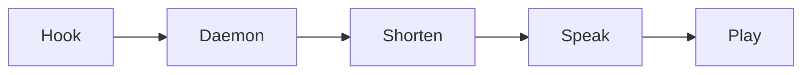

# Architecture

This page is the short version. The [design record](design.md) holds the measurements and the
alternatives that were rejected.

## The pipeline

The hook is Claude Code's `Stop` hook, calling the daemon over a Unix socket. Shortening goes
to Ollama `gemma3:4b` only for replies over 200 characters once code, tables and paths are
stripped. The player is PowerShell on
Windows, reading the WAV that Kokoro wrote to `audio_dir`.

1. **Hook.** The `keryx hook` entries are async, so Claude Code never waits on them. `Stop`
   sends the reply, `Notification` sends permission and elicitation prompts, and
   `SessionStart` and `UserPromptSubmit` start the daemon and preload the summarizer.
   `bin/keryx-replay` runs synchronously on `UserPromptSubmit`, screens the prompt in the
   shell, and starts Python only for a short prompt that could be "say that again".
2. **Daemon.** One daemon per machine listens on a Unix socket, guarded by a lock file so a
   second daemon exits instead of taking over the socket. One queue serves every session.
3. **Shorten.** The daemon strips code, tables, headings and paths. A reply of 200 characters
   or fewer is spoken as written. A longer one goes to the Ollama model, which rewrites it as
   one or two sentences. If Ollama is unreachable or fails, the opening sentences are spoken
   instead, up to 320 characters.
4. **Speak.** Kokoro-82M, through `kokoro-onnx`, turns each sentence into audio. It runs on
   CUDA when the `cuda` extra is installed and falls back to the CPU provider otherwise.
   Synthesis runs up to two sentences ahead of playback. Each sentence is brought to the configured
   loudness (-16 LUFS by default) and limited so sample peaks stay under -1.5 dBFS.
5. **Play.** One long-lived PowerShell process plays each WAV through MCI and reports when
   the clip stops. The WAV must sit on a Windows drive.

## Why playback goes through Windows

WSLg's PulseAudio sink suspends when idle and then drops or hangs streams
([microsoft/wslg#1392](https://github.com/microsoft/wslg/issues/1392)). PowerShell plays
reliably. A fresh `powershell.exe` costs 309 to 444 ms, so one process stays open and takes
`play`, `mode`, `stop`, `duck` and `unduck` lines on stdin.

## Sessions and terminals

- A new prompt cancels speech owned by that session or by the same terminal.
- Each request carries a `prompt_id`. Hooks run async, so a reply's hook can land after the
  next prompt's, and the daemon drops a reply from an older prompt than the session's latest.
- A terminal is its Claude Code process, found as the hook's nearest ancestor named `claude` or `claude-code`. An npm install,
  which runs as `node .../@anthropic-ai/claude-code/cli.js`, counts too.
  It holds its voice while that process runs, through `/clear` and resume.
- A repo keeps the voice it was first given, stored by label in `voices.json`. The repo name
  is read from `.git` directly, so a prompt never waits on a `git` subprocess.
- Headless sessions (`claude -p` and the Agent SDK) stay silent.
- The daemon exits after 4 hours idle.

## Cold start

Ollama aborts a model load when its client hangs up. The summarizer therefore loads the model
first under a 120 second timeout, then generates under 30 seconds. The model stays loaded 30
minutes after its last use. `SessionStart` and each prompt preload it, so the load happens
while you type and while Claude works.

## Why "keryx"

A *keryx* (κῆρυξ) was a herald in ancient Greece: the one who carried
a message and announced it aloud, briefly, to the people it concerned. keryx does the same for
a Claude Code reply.
